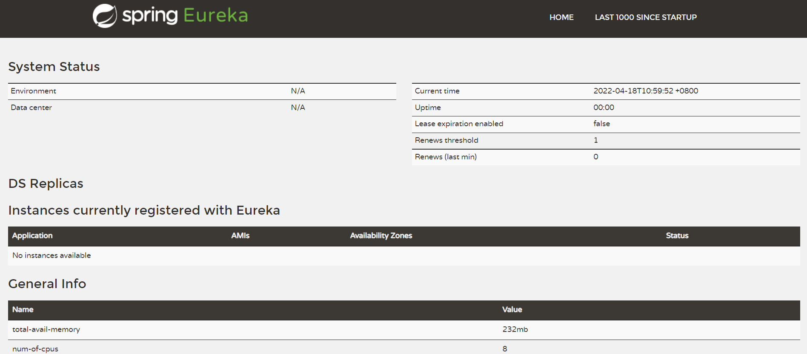

# Eureka 单点搭建

1. pom.xml
```yaml
<dependency>
	<groupId>org.springframework.cloud</groupId>
	<artifactId>spring-cloud-starter-netflix-eureka-server</artifactId>
</dependency>
当然通过Spring启动器去创建即可
有的教程中还引入spring-boot-starter-web，其实不用。因为上面的依赖已经包含了它。在pom中点此依赖进去，一共点4次spring-cloud-netflix-eureka-server，发现web的依赖
```

2. application.yml
```yaml
eureka: 
  client:
    #是否将自己注册到Eureka Server,默认为true，由于当前就是server，故而设置成false，表明该服务不会向eureka注册自己的信息
    register-with-eureka: false
    #是否从eureka server获取注册信息，由于单节点，不需要同步其他节点数据，用false
    fetch-registry: false
    #设置服务注册中心的URL，用于client和server端交流
    service-url:                      
      defaultZone: http://localhost:7900/eureka/
```

3. 代码 
```java
// 启动类上添加此注解标识该服务为配置中心
@EnableEurekaServer
```
配置完成之后，访问：localhost:8080   出现如图所示



